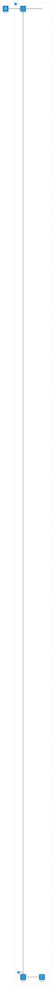

# Mermaid: Architecture

```mermaid
architecture-beta
  group api(cloud)[API]
  group data(database)[Data] in api

  service db(database)[Database] in data
  service disk1(disk)[Storage] in data
  service server(server)[Server] in api
  service gateway(internet)[Gateway]
  junction j1

  gateway:R --> L:server
  server:B --> T:db
  db:R -- L:disk1
  server:R -- L:j1
```

[← Back to index](../mermaid.md)
