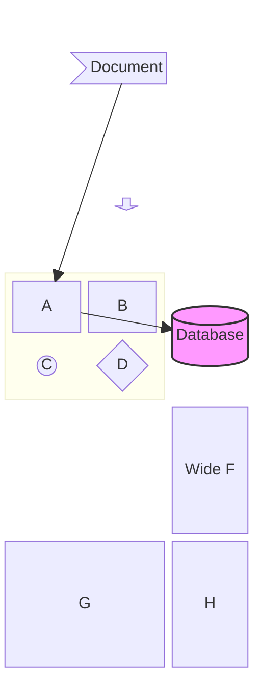

# Mermaid: Block Diagram

```mermaid
block-beta
  columns 3
  doc>"Document"]:3
  space down1<[" "]>(down) space
  block:group1:2
    columns 2
    a["A"] b["B"]
    c(("C")) d{"D"}
  end
  e[("Database")]
  space:2 f["Wide F"]
  g["G"]:2 h["H"]
  doc --> a
  a --> e
  style e fill:#f9f,stroke:#333,stroke-width:2px
```

[← Back to index](../mermaid.md)
