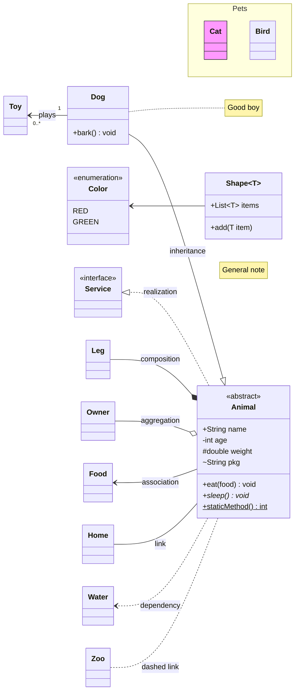

# Mermaid: Class Diagram

```mermaid
classDiagram
  direction RL
  note "General note"
  class Animal {
    <<abstract>>
    +String name
    -int age
    #double weight
    ~String pkg
    +eat(food) void
    +sleep()* void
    +staticMethod()$ int
  }
  class Dog {
    +bark() void
  }
  class Shape~T~ {
    +List~T~ items
    +add(T item)
  }
  class Color {
    <<enumeration>>
    RED
    GREEN
  }
  class Service {
    <<interface>>
  }
  Animal <|-- Dog : inheritance
  Animal *-- Leg : composition
  Animal o-- Owner : aggregation
  Animal --> Food : association
  Animal -- Home : link
  Animal ..> Water : dependency
  Animal ..|> Service : realization
  Animal .. Zoo : dashed link
  Dog "1" --> "0..*" Toy : plays
  Shape~T~ --> Color
  note for Dog "Good boy"
  namespace Pets {
    class Cat
    class Bird
  }
  callback Dog "alertFn" "Tooltip"
  click Animal href "https://example.com" "Open"
  cssClass "Dog" highlight
  style Cat fill:#f9f,stroke:#333
```

[← Back to index](../mermaid.md)
