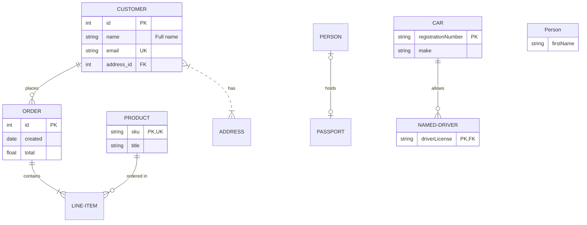

# Mermaid: Entity Relationship Diagram

```mermaid
erDiagram
  CUSTOMER ||--o{ ORDER : places
  ORDER ||--|{ LINE-ITEM : contains
  PRODUCT ||--o{ LINE-ITEM : "ordered in"
  CUSTOMER }|..|{ ADDRESS : "has"
  PERSON |o--o| PASSPORT : holds
  CUSTOMER {
    int id PK
    string name "Full name"
    string email UK
    int address_id FK
  }
  ORDER {
    int id PK
    date created
    float total
  }
  PRODUCT {
    string sku PK, UK
    string title
  }
  CAR ||--o{ NAMED-DRIVER : allows
  CAR {
    string registrationNumber PK
    string make
  }
  NAMED-DRIVER {
    string driverLicense PK, FK
  }
  p[Person] {
    string firstName
  }
```

[← Back to index](../mermaid.md)
