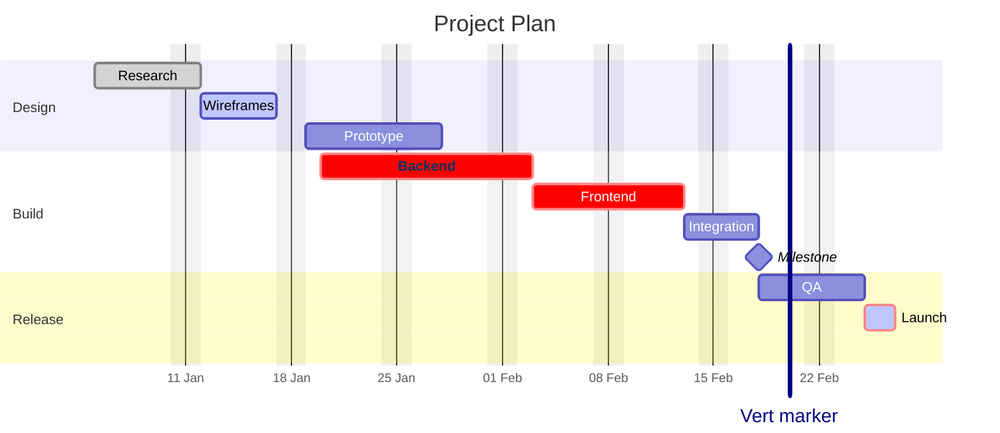

# Mermaid: Gantt

```mermaid
gantt
  title Project Plan
  dateFormat YYYY-MM-DD
  axisFormat %d %b
  tickInterval 1week
  excludes weekends
  todayMarker stroke-width:3px,stroke:#f00
  section Design
    Research        :done,    des1, 2026-01-05, 2026-01-12
    Wireframes      :active,  des2, after des1, 5d
    Prototype       :         des3, after des2, 1w
  section Build
    Backend         :crit,    b1, 2026-01-20, 10d
    Frontend        :crit,    b2, after b1, 8d
    Integration     :         b3, after b2, 3d
    Milestone       :milestone, m1, after b3, 0d
  section Release
    QA              :         q1, after b3, 5d
    Launch          :crit, active, l1, after q1, 2d
    Vert marker     :vert, v1, 2026-02-20, 0d
  click b1 href "https://example.com"
```

[← Back to index](../mermaid.md)
