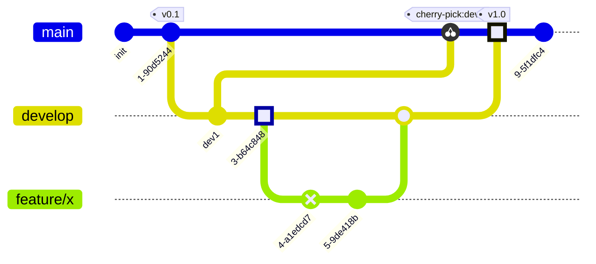
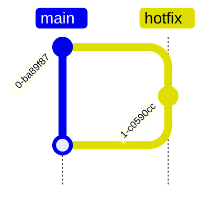

# Mermaid: GitGraph

```mermaid
gitGraph
  commit id: "init"
  commit tag: "v0.1"
  branch develop
  checkout develop
  commit id: "dev1"
  commit type: HIGHLIGHT
  branch feature/x order: 3
  checkout feature/x
  commit type: REVERSE
  commit
  checkout develop
  merge feature/x
  checkout main
  cherry-pick id: "dev1"
  merge develop tag: "v1.0" type: HIGHLIGHT
  commit type: NORMAL
```

```mermaid
gitGraph TB:
  commit
  branch hotfix
  checkout hotfix
  commit
  checkout main
  merge hotfix
```

[← Back to index](../mermaid.md)
