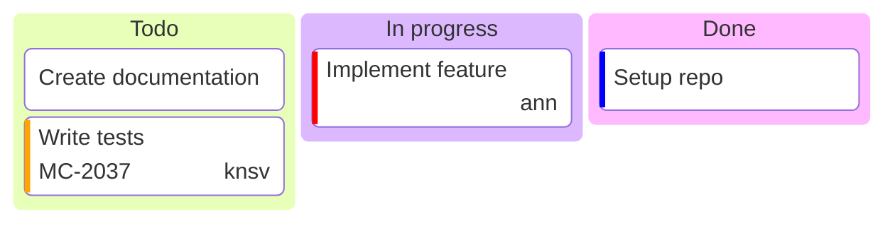

# Mermaid: Kanban

```mermaid
kanban
  todo[Todo]
    id1[Create documentation]
    id2[Write tests]@{ assigned: 'knsv', ticket: MC-2037, priority: 'High' }
  doing[In progress]
    id3[Implement feature]@{ assigned: 'ann', priority: 'Very High' }
  done[Done]
    id4[Setup repo]@{ priority: 'Low' }
```

[← Back to index](../mermaid.md)
