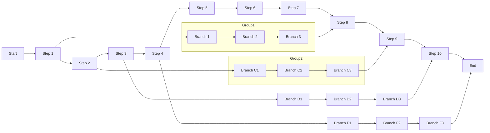

# Mermaid: Large diagram (fullscreen, pan and zoom test)

```mermaid
flowchart LR
  S1[Start] --> A1[Step 1] --> A2[Step 2] --> A3[Step 3] --> A4[Step 4] --> A5[Step 5] --> A6[Step 6] --> A7[Step 7] --> A8[Step 8] --> A9[Step 9] --> A10[Step 10] --> E1[End]
  A1 --> B1[Branch 1] --> B2[Branch 2] --> B3[Branch 3] --> A8
  A2 --> C1[Branch C1] --> C2[Branch C2] --> C3[Branch C3] --> A9
  A3 --> D1[Branch D1] --> D2[Branch D2] --> D3[Branch D3] --> A10
  A4 --> F1[Branch F1] --> F2[Branch F2] --> F3[Branch F3] --> E1
  subgraph Group1
    B1
    B2
    B3
  end
  subgraph Group2
    C1
    C2
    C3
  end
```

[← Back to index](../mermaid.md)
