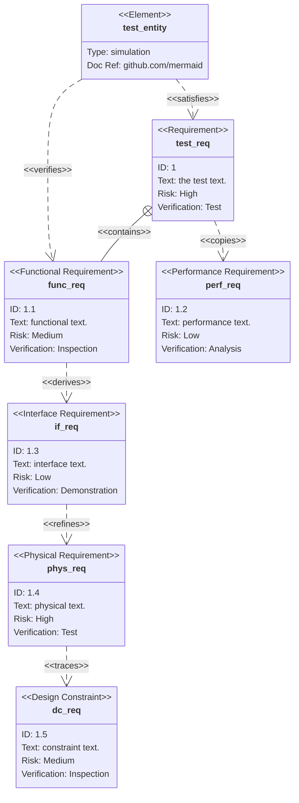

# Mermaid: Requirement Diagram

```mermaid
requirementDiagram
  requirement test_req {
    id: 1
    text: the test text.
    risk: high
    verifymethod: test
  }
  functionalRequirement func_req {
    id: 1.1
    text: functional text.
    risk: medium
    verifymethod: inspection
  }
  performanceRequirement perf_req {
    id: 1.2
    text: performance text.
    risk: low
    verifymethod: analysis
  }
  interfaceRequirement if_req {
    id: 1.3
    text: interface text.
    risk: low
    verifymethod: demonstration
  }
  physicalRequirement phys_req {
    id: 1.4
    text: physical text.
    risk: high
    verifymethod: test
  }
  designConstraint dc_req {
    id: 1.5
    text: constraint text.
    risk: medium
    verifymethod: inspection
  }
  element test_entity {
    type: simulation
    docref: github.com/mermaid
  }
  test_entity - satisfies -> test_req
  test_req - contains -> func_req
  test_req - copies -> perf_req
  func_req - derives -> if_req
  if_req - refines -> phys_req
  phys_req - traces -> dc_req
  test_entity - verifies -> func_req
```

[← Back to index](../mermaid.md)
