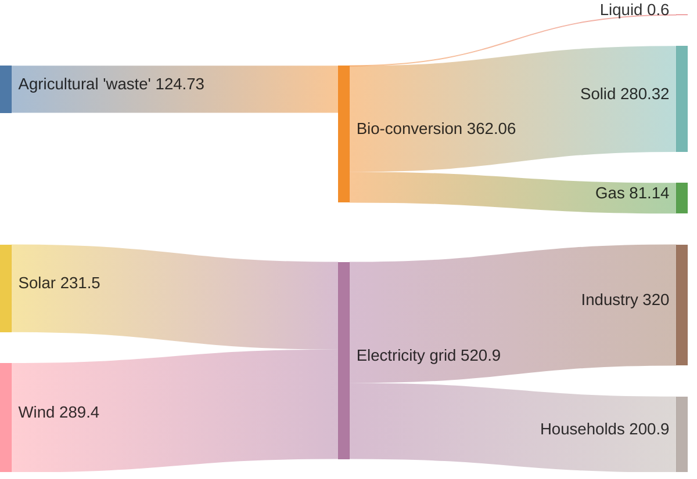

# Mermaid: Sankey

```mermaid
sankey-beta
Agricultural 'waste',Bio-conversion,124.729
Bio-conversion,Liquid,0.597
Bio-conversion,Solid,280.322
Bio-conversion,Gas,81.144
Solar,Electricity grid,231.5
Wind,Electricity grid,289.4
Electricity grid,Industry,320
Electricity grid,Households,200.9
```

[← Back to index](../mermaid.md)
