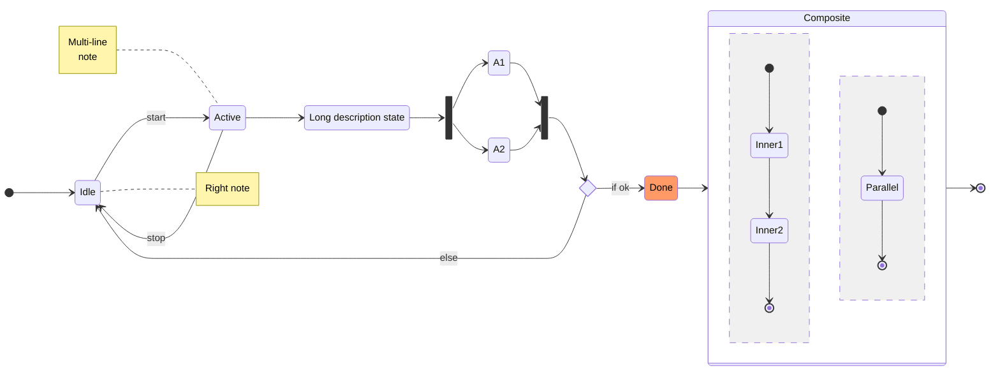
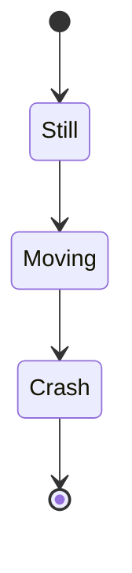

# Mermaid: State Diagram

```mermaid
stateDiagram-v2
  direction LR
  [*] --> Idle
  Idle --> Active : start
  Active --> Idle : stop
  state "Long description state" as LD
  Active --> LD
  state Fork <<fork>>
  state Join <<join>>
  state Choice <<choice>>
  LD --> Fork
  Fork --> A1
  Fork --> A2
  A1 --> Join
  A2 --> Join
  Join --> Choice
  Choice --> Done : if ok
  Choice --> Idle : else
  state Composite {
    [*] --> Inner1
    Inner1 --> Inner2
    Inner2 --> [*]
    --
    [*] --> Parallel
    Parallel --> [*]
  }
  Done --> Composite
  Composite --> [*]
  note right of Idle : Right note
  note left of Active
    Multi-line
    note
  end note
  classDef bad fill:#f96,color:#000
  class Done bad
```

Legacy keyword:

```mermaid
stateDiagram
  [*] --> Still
  Still --> Moving
  Moving --> Crash
  Crash --> [*]
```

[← Back to index](../mermaid.md)
