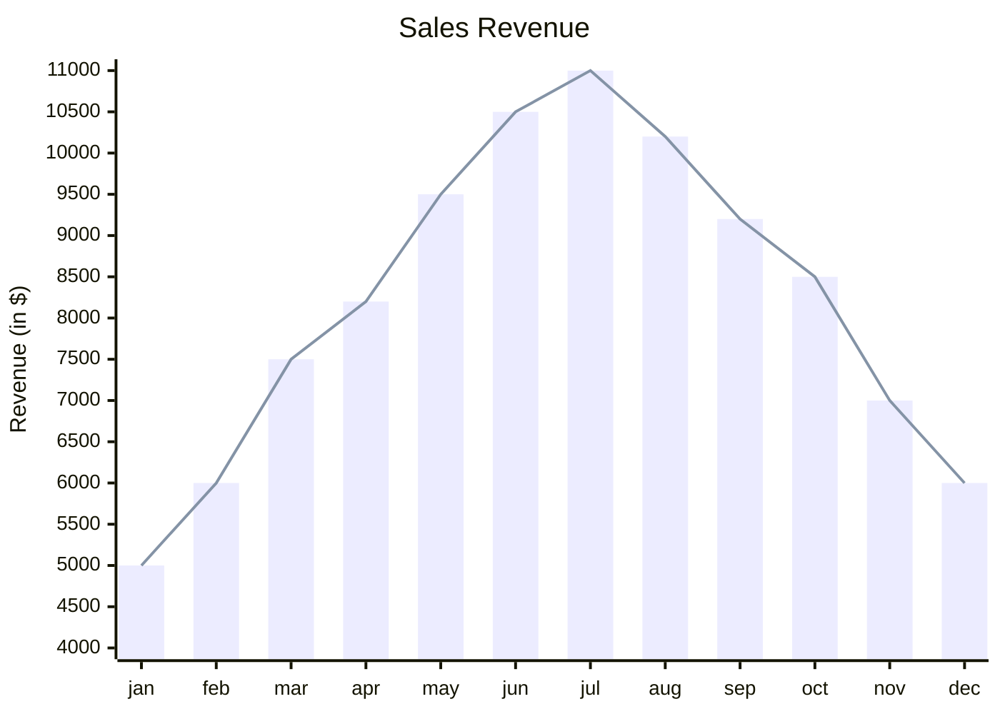
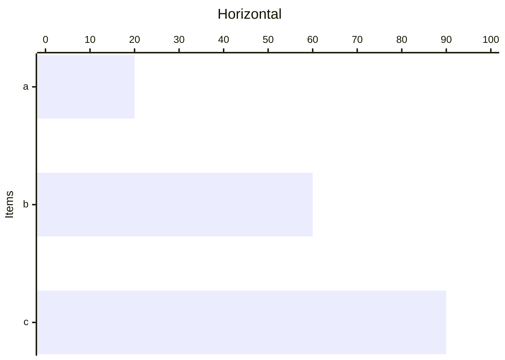

# Mermaid: XY Chart

```mermaid
xychart-beta
  title "Sales Revenue"
  x-axis [jan, feb, mar, apr, may, jun, jul, aug, sep, oct, nov, dec]
  y-axis "Revenue (in $)" 4000 --> 11000
  bar [5000, 6000, 7500, 8200, 9500, 10500, 11000, 10200, 9200, 8500, 7000, 6000]
  line [5000, 6000, 7500, 8200, 9500, 10500, 11000, 10200, 9200, 8500, 7000, 6000]
```

```mermaid
xychart-beta horizontal
  title "Horizontal"
  x-axis "Items" [a, b, c]
  y-axis 0 --> 100
  bar [20, 60, 90]
```

[← Back to index](../mermaid.md)
