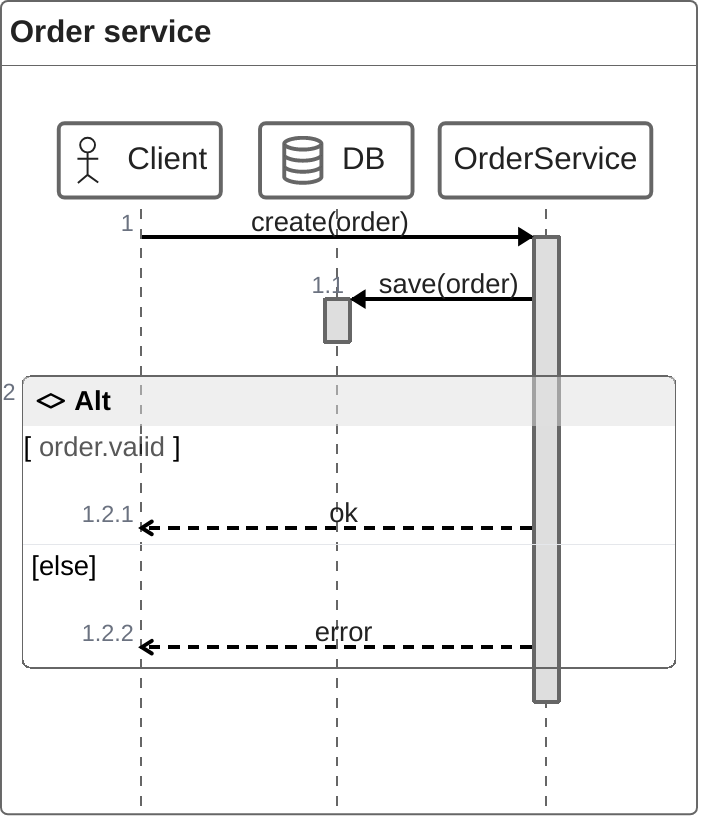

# Mermaid: ZenUML

```mermaid
zenuml
  title Order service
  @Actor Client
  @Database DB
  Client->OrderService.create(order) {
    DB.save(order)
    if (order.valid) {
      return "ok"
    } else {
      return "error"
    }
  }
```

[← Back to index](../mermaid.md)
